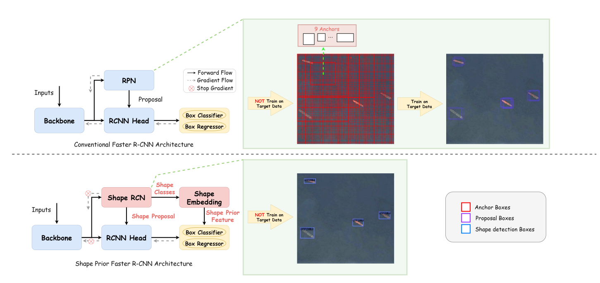
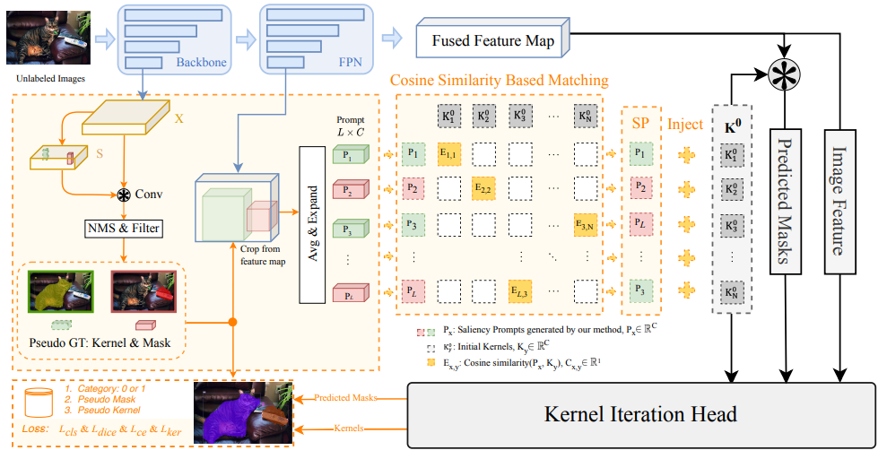








# 👨‍🎓 About Me

I'm a post-graduate student at [University of Chinese Academy of Sciences (UCAS)](https://www.ucas.ac.cn), and received B.Eng. degree from the College of Information Science and Technology, [Beijing University of Chemical Technology (BUCT)](https://www.buct.edu.cn). As a member of the [AIRCAS](http://www.aircas.cas.cn/), My research interests include computer vision and deep learning.

# 🔥 News

*2022.06.22*  🎉🎉 Received an acceptance letter from the AIRCAS, University of Chinese Academy of Sciences!

# 📝 Publications

CVPR 2023

**[Learning with Shape Prior for Object Detection](../images/daiyalun_images/shape_prior.png)** (Under Review)

**Yalun Dai**, Fan Zhang*, Fei Ma, Hao Li, Wei Hu

CVPR 2023

**[Boosting Low-Data Instance Segmentation by Unsupervised Pre-training with Saliency Prompt](../images/daiyalun_images/boost_low_data.png)** (Under Review)

<!-- **Yalun Dai**, Fan Zhang* -->
Hao Li, Dingwen Zhang*, Nian Liu, Lechao Cheng, **Yalun Dai**, Chao Zhang, Xinggang Wang, Junwei Han

# 📖 Educations

- *2022.09 - 2025.06 (now)*, Post-graduate, AIRCAS, University of Chinese Academy of Sciences, Beijing
- *2018.09 - 2022.06*, Undergraduate, the College of Information Science and Technology, Beijing University of Chemical and Technology, Beijing
- *2015.09 - 2018.06*, The High School Attached to Hu'nan Normal University, ChangSha

# 🎖 Honors and Awards

- *2019.10* Endress+Hauser Corporate Scholarship (Top 3%)
- *2020.10* Hollysys Corporate Scholarship (Top 3%)

# 💻 Works

- *2021.07 - 2021.12*, [Beijing Huada Zhibao Electronic System Co., Ltd.](https://www.bhz.com.cn/en), **Embedded System Engineer Intern**, Beijing.
- *2022.04 - 2022.09*, [Analog Devices, Inc. (ADI)](https://www.analog.com/en/index.html), **Systems Integration Engineer Intern**, Beijing.
- *2022.09 - now*, [Qiyuan Lab of TsingHua University](https://zhuanlan.zhihu.com/p/513570934), **Visual Perception Algorithm Intern**, Beijing.
- *2022.01 - now*, [CubeVi](http://www.cubevi.com/), **Co-founder**, Beijing.
